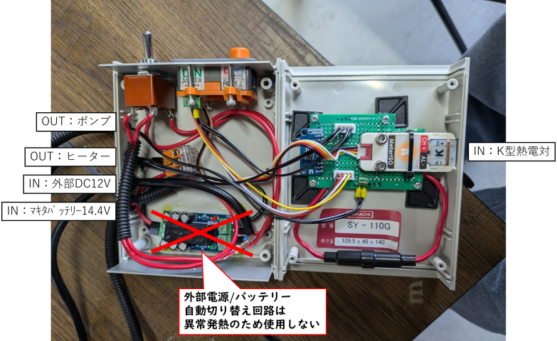

# Chibi-T Furoshiki Heater

## 概要

Chibi-T Furoshiki Heater は M5DinMeter（M5Stack StampS3） + M5Unit Kmeter ISO を用いて液体（水）を目標温度帯に維持するための制御ユニットです。  
ポンプ循環・ヒーター加熱・（将来的な）冷却ファン制御を行い、エンコーダ操作と TFT 表示で設定変更、BLE 通知で現在温度の取得が可能です。  
ふろしき号に搭載したエコラン用エンジンの温度安定化が目的です。

## 主な構成要素

- [M5Stack StampS3](https://docs.m5stack.com/en/core/StampS3)  
  - ESP32-S3マイコンボード
- [M5DinMeter](https://docs.m5stack.com/ja/core/M5DinMeter)  
  - 表示・ボタン・スピーカ・ロータリエンコーダ
- [M5Unit Kmeter ISO](https://docs.m5stack.com/en/unit/KMeterISO%20Unit)  
  - 熱電対温度計測ユニット
- [TB67H450FNG搭載モータドライバ ピッチ変換基板](https://www.switch-science.com/products/5880)
  - 冷却水循環ポンプ制御用モータドライバ
- [冷却水循環ポンプ](https://ja.aliexpress.com/item/4000630739217.html)
- [冷却水加温ヒーター](https://www.amazon.co.jp/dp/B0BT9LBFXZ)
  - DC12V/95W 車載ポット
  - EXTIO2でON/OFF制御予定（コメントアウト中）
- 冷却ファン
  - EXTIO2でON/OFF予定（コメントアウト中）
- [タカチ・SY-110G](https://www.takachi-el.co.jp/products/SY)  
  - ケース
- BLE 通信
  - 現在温度の Notify 配信
- EEPROM 不揮発設定保存
  - ポンプ速度
  - 上限温度
  - 下限温度

## 機能一覧

1. 温度取得タスク: FreeRTOS タスク `TempRead` が熱電対値を 1 秒周期（`sleeptime`）で取得し、BLE Notify を送信。
2. 温度表示: 現在温度と設定値（Target / 変更対象）を TFT に表示。
3. モード遷移: BtnA 短押しで `temp -> pump -> Hi -> Lo -> (戻る)` のローテーション。
4. ポンプ制御: PWM (LED PWM `ledcWrite`) により 0–100% を 8bit (0–255) へマッピング。
5. ヒーター / 冷却制御: 現在温度が閾値を超過すると `cooling`、下限より低いと `heating` 状態フラグ。EXTIO2 実装予定のため現状はフラグのみ + ポンプ停止/始動で間接制御。
6. 目標温度算出: `TargetTemp = (HiTemp + LoTemp)/2`。
7. EEPROM 保存: 起動時 BtnA 押下で初期値保存。通常動作中 BtnA 長押し(2000ms)で現在設定値を保存。
8. BLE Peripheral: 温度を Notify する Characteristics を提供。接続維持と再アドバタイズ処理。
9. エンコーダ読取: PCNT (Pulse Counter) にて方向とステップを判定し、現在モードの設定値を増減。
10. Web OTA: 起動時にエンコーダを3秒以上長押しすると Wi-Fi AP + ブラウザ経由のファームウェア更新モードへ移行（USB接続不要）。

## 画面表示と操作

- BtnA 短押し: 次の設定モードへ遷移し画面更新（背景クリア）。
- BtnA 長押し(約2秒): 設定値(EERPOM)へ保存。保存成功で背景を赤 (2000ms) → 黒へ戻す。
- モード別変更対象:
  - temp: 目標温度は表示のみ（値は Hi/Lo 調整から自動計算）
  - pump: ポンプ速度 `PUMP_SPEED` を ±5% で調整
  - Hi: 上限温度 `HiTemp` を ±1℃ 調整
  - Lo: 下限温度 `LoTemp` を ±1℃ 調整
- 冷却中: 「COOL」表示を青背景/黒文字
- 加熱中: 「HEAT」表示をオレンジ背景/黒文字

## BLE 仕様

- デバイス名: `M5Din Furoshiki Heater`
- Service UUID: `7c44181A-c1a4-4635-a119-b490ed272552`
- Characteristic(UUID=Read/Write): `7c442A00-c1a4-4635-a119-b490ed272552`
  - 初期値: `Engine Temp`
  - 用途: 将来設定取得・変更用途を想定（現状未使用）
- Notify Characteristic UUID: `7c442A6E-c1a4-4635-a119-b490ed272552`
  - 値: 現在温度を文字列化したもの (例: `"82.34"`)
  - フォーマット: 小数点付き Celsius。端末側で `float` へ変換。
- 接続処理: 接続時 Advertising 停止。切断時再開。

## EEPROM 保存フォーマット

| オフセット | 内容 | 型 | 備考 |
| --------- | ---- | -- | ---- |
| 0 | PUMP_SPEED | int8_t | 0–100 (%) |
| sizeof(PUMP_SPEED) | HiTemp | int8_t | 上限温度 (℃) |
| sizeof(PUMP_SPEED)+sizeof(HiTemp) | LoTemp | int8_t | 下限温度 (℃) |

- `EEPROM.begin(SIZE)` で 32 バイト確保。
- 保存トリガ: 起動時 BtnA 押下 / 動作中 BtnA 長押し(2000ms)。
- 保存後 `EEPROM.commit()` 成功で赤画面点灯。

## Web OTA（ファームウェア更新）

USBケーブルを接続せず、ブラウザ経由で無線ファームウェア更新ができます。

- 起動トリガ: 電源投入時にエンコーダ(BtnA)を押したまま起動し、そのまま**3秒以上**ホールドすると Web OTA モードへ移行。
  - **3秒未満**で離した場合は従来通り EEPROM 初期値書き込み（工場出荷リセット）が実行されます（挙動は変更なし）。
- Web OTA モードに入ると、通常の温度制御・BLE・エンコーダ設定変更は一切動作せず、TFT に以下を表示します。
  - AP SSID / パスワード / 割り当てIPアドレス / 状態（`Waiting for upload...` など）
- 接続手順:
  1. PC・スマホの Wi-Fi 設定で SSID `ChibiT-Heater-OTA`（パスワード `chibit-ota-2026`）に接続。
  2. ブラウザで `http://192.168.4.1/` を開く。
  3. アップロードフォームで PlatformIO でビルドした `firmware.bin`（`.pio/build/m5stack-stamps3/firmware.bin`）を選択しアップロード。
  4. 書き込み成功後は画面に `Success! Rebooting...` と表示され、自動的に再起動して通常モードへ復帰します。
  5. 書き込みに失敗した場合は `Update FAILED. Retry.` を表示したまま待機するので、再アップロードしてください。
- 実装は Arduino-ESP32 標準ライブラリ（`WiFi` / `WebServer` / `Update`）のみで構成されており、追加の外部 OTA ライブラリには依存していません。

## セットアップ手順

1. ハード準備:
   - StampS3 + DinMeter 組み立て
   - Kmeter ISO を `PortA`に I2C 接続 (SDA/SCL: DinMeter 基板定義ピン) ※コード内で `kmeter.begin(&Wire, KMETER_DEFAULT_ADDR, SDA, SCL, 100000L)`
   - モータドライバの `IN1` を `PortB` の `Pin2` へ接続
   - ヒーター / 冷却ファンは現在未接続（EXTIO2 実装前）

   

2. 開発環境:
   - VSCode + PlatformIO
   - プロジェクトを開く (`platformio.ini` 参照)
3. ライブラリ:
   - 自動取得: `M5DinMeter`, `M5Unit-KMeterISO`
4. ビルド & 書き込み:
   - PlatformIO で環境 `m5stack-stamps3` を選択し Upload。
5. シリアルモニタ:
   - ボーレート `115200`。
6. BLE 確認:
   - スマホ等でスキャンしデバイス名を選択。
   - Notify Characteristic を購読して温度更新を受信。

## 温度制御ロジック

- 冷却判定: `NowTemperature > HiTemp`  
  → cooling=true（ポンプ停止で実質放熱）
- 冷却解除: `NowTemperature < TargetTemp`  
  → cooling=false
- 加熱判定: `NowTemperature < LoTemp`  
  → heating=true（ポンプ稼働）
- 加熱解除: `NowTemperature > TargetTemp`  
  → heating=false

## 安全上の注意・推奨

- 上限温度 (`HiTemp`) は過熱防止のため用途に合わせ適切に設定 (例: 85℃ 初期値)
- ポンプ停止中に急激な温度上昇があればヒーター制御（今後 EXTIO2）を追加するか警報機能を検討
- センサー異常 (`error_status != 0`) の場合はシリアルへ Error 出力  
  将来的にフェイルセーフとしてヒーター停止処理を追加予定

## ビルドオプション抜粋 (`platformio.ini`)

```ini
platform = espressif32 @ 6.7.0
board = m5stack-stamps3
monitor_speed = 115200
build_flags = -D ARDUINO_USB_CDC_ON_BOOT=1 -DCORE_DEBUG_LEVEL=0
```

## 仕様・設定値

| 項目 | 仕様・設定値 | 備考 |
| ---- | -------- | ---- |
| EXTIO2 最終構成 | 未定 | ピン番号/電力仕様は後日確定。現状ヒーター/ファン制御はコメントアウト。 |
| ポンプPWM周波数 | 1000 Hz | ノイズ・キャビテーション問題なし。 |
| 温度帯 | 80±5℃ (Hi=85 / Lo=75) | Target=(Hi+Lo)/2。 |
| センサー異常時フェイルセーフ | 不要 | 異常時はシリアルログのみ。<BR>強制停止動作は実装しない方針。 |
| BLE 書き換えパラメータ | なし | 現状は温度 Notify のみ。<BR>設定変更は本体操作。 |
| エンコーダステップ | ポンプ ±5%, 温度 ±1℃ | |
| ログ保存/外部連携 | 外部 BLE Central へ転送 | 受信側: [M5NanoC6_BLE_Central](https://github.com/todateman/M5NanoC6_BLE_Central) |
| Web OTA 起動ホールド時間 | 3秒以上 | 3秒未満はEEPROM初期化(従来動作)。 |
| Web OTA AP SSID / パスワード | `ChibiT-Heater-OTA` / `chibit-ota-2026` | ソースコード内定数、変更可。 |
| Web OTA アクセスURL | `http://192.168.4.1/` | AP接続後にブラウザでアクセス。 |

### 今後の検討候補

- EXTIO2 ピン割り当てと電力(ヒータ容量, ファン電流)の確定
- センサー異常時の簡易警告表示（背景色変更やビープ）
- BLE 経由での省電力ステータス照会（必要なら）

## ライセンス

本プロジェクトは MIT License で公開されています。詳細はルートの `LICENSE` ファイルを参照してください。
利用している外部ライブラリ（`M5DinMeter`, `M5Unit-KMeterISO` など）は各ライブラリのライセンスに従います。
